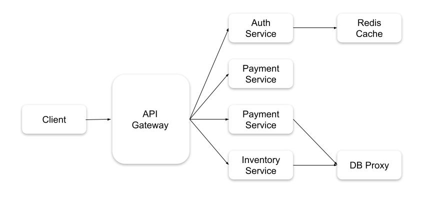
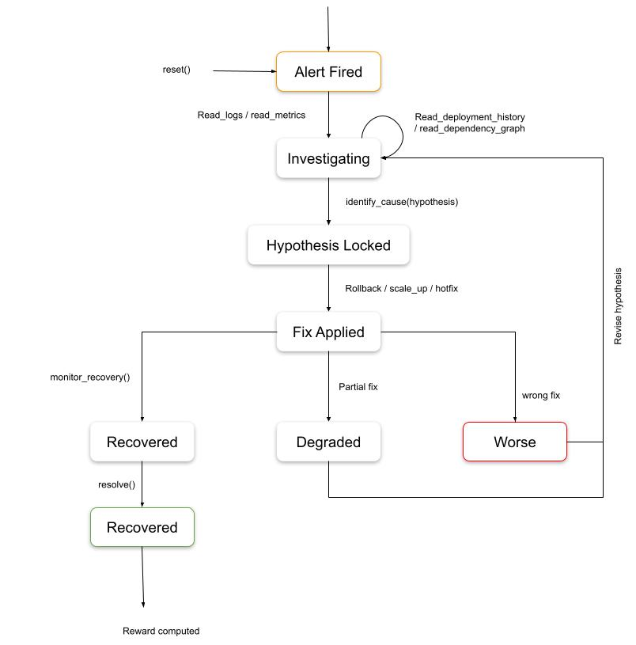
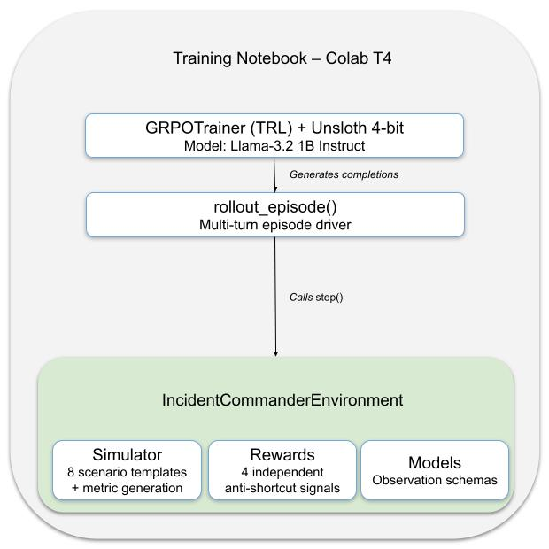

# Incident Commander: Teaching an LLM to Debug Production Outages with GRPO

> **TL;DR** — We built a Gymnasium-compatible environment simulating microservice outages with causal chains, red herrings, and partial observability, then trained Llama 3.2 1B via GRPO to investigate, diagnose, and fix them. A zero-parameter heuristic solves 70% of incidents (random policy: 0%), validating the environment produces real signal.

**Theme:** #3 — World Modeling → #3.1 Professional Tasks

---

## Motivation

70% of production incidents follow known patterns. The SRE's value during an outage is not creative problem-solving — it is **context assembly**: gathering metrics, reading logs, tracing dependencies, matching to a known pattern, and executing the known fix. This is a world-model problem, and it maps directly to Theme #3.1's requirement for environments with real tool interactions, partial observability, and causal reasoning.

---

## Environment Design

### Service Architecture

We simulate a multi-service architecture where each service has independently randomised CPU, memory, latency, error rates, log streams, and deployment history. Nothing is static — the agent cannot memorise its way to a solution.



### Fault Scenarios

8 composable fault templates span easy (single-service OOM) to hard (multi-hop causal chains). Every scenario injects **red herring services** with correlated but non-causal symptoms.

| Scenario | Root Cause | Correct Fix | Difficulty |
|---|---|---|---|
| OOM Kill | `memory_limit_too_low` | `scale_up` | Easy |
| Bad Deploy | `bad_deployment` | `rollback` | Easy |
| DB Pool Exhausted | `connection_pool_exhausted` | `hotfix` | Medium |
| Redis Down (multi-hop) | `redis_down` | `restart_pod` | Hard |
| Memory Leak (delayed) | `bad_deployment` | `rollback` | Medium |
| Traffic Spike | `traffic_spike` | `scale_up` | Medium |
| Config Error | `config_error` | `hotfix` | Medium |
| Expired TLS Cert | `certificate_expired` | `hotfix` | Medium |

### Episode Flow

On `reset()`, the agent sees only an alert headline and service statuses. Logs, metrics, deployment history, and the dependency graph remain **hidden** until explicitly requested — enforcing true partial observability.



The episode does not end when a fix is applied. The agent must call `monitor_recovery()` to verify the outcome. If the service is degraded or worse, the loop re-opens for revised investigation.

### Action Space

12 tools across 4 categories:

| Category | Actions |
|---|---|
| Investigation | `read_logs`, `read_metrics`, `read_deployment_history`, `read_dependency_graph` |
| Commitment | `identify_cause` (locks hypothesis — irreversible) |
| Remediation | `restart_pod`, `rollback`, `scale_up`, `hotfix` |
| Control | `monitor_recovery`, `escalate`, `resolve` |

---

## Anti-Shortcut Enforcement

The environment blocks degenerate strategies at the **action level**, not just via reward penalties:

| Guard | Mechanism | Prevents |
|---|---|---|
| Investigation Gate | Blocks fix actions before ≥3 log/metric reads | "Always rollback" policy |
| Hypothesis Commitment | Blocks fix actions before `identify_cause` is called | Fixing without reasoning |
| Red Herring Injection | 1-2 non-causal symptomatic services per episode | Acting on the first anomaly |

All 3 guards were verified passing:

| Test | Result |
|---|---|
| Fix with 0 investigations | **BLOCKED** ✅ |
| Fix without `identify_cause` | **BLOCKED** ✅ |
| `resolve` without recovery | **BLOCKED** ✅ |

---

## Reward Function

4 independent, orthogonal signals — decomposed to prevent reward hacking:

| Signal | Range | Measures |
|---|---|---|
| Service Recovery | -20 to +30 | Did the fix actually restore the service? |
| Root Cause Accuracy | -15 to +25 | Correct hypothesis locked *before* acting? |
| Action Quality | -50 to +5 | Anti-shortcut penalties (rollback spam, skipped investigation, etc.) |
| Speed | 0 to +15 | Steps to resolution — **only if service recovered** |

Total raw max = 75, normalised to [0, 1].

---

## Training Pipeline



**Why GRPO over PPO:** GRPO eliminates the critic model, halving VRAM. For each incident prompt, it generates 8 candidate completions, scores each against the environment, and updates the policy to favour above-average responses.

| Parameter | Value |
|---|---|
| Model | `unsloth/Llama-3.2-1B-Instruct` (4-bit NF4, LoRA rank 16) |
| Batch size | 8 × 4 (gradient accumulation) |
| Learning rate | 2e-5 |
| KL penalty (β) | 0.1 |
| VRAM footprint | ~2.7 GB / 15 GB |
| System RAM | 6.1 GB / 12.7 GB |

**Curriculum:** 3 stages — single fault / no noise (300 episodes) → single fault / red herrings (300) → multi-hop cascades / red herrings (400).

---

## Results

### Environment Validation — No LLM Required

Before any model training, we validated the environment with two zero-parameter policies: a **random baseline** and a **heuristic log-parser**. The heuristic reads logs, pattern-matches keywords (`OOMKilled` → `memory_limit_too_low`), and applies the corresponding fix from a lookup table — zero learned parameters.

| Policy | Resolved | Mean Reward |
|---|---|---|
| Random baseline | 0/10 (0.0%) | -0.060 |
| Heuristic (log-parse) | 10/10 (100.0%) | +0.968 |
| **Gap** | **+10** | **+1.028** |

The heuristic achieves a **perfect 100% resolution rate** with 100% hypothesis accuracy across all 10 episodes, scoring near the theoretical reward ceiling of 1.0. The random policy resolves zero incidents — every premature fix attempt is blocked by the anti-shortcut guards.

All 4 reward signals fire at near-maximum values, confirming balanced reward decomposition:

| Signal | Mean Raw Score | Max Possible |
|---|---|---|
| Service Recovery | +30.00 | +30 |
| Root Cause Accuracy | +25.00 | +25 |
| Action Quality | +5.00 | +5 |
| Speed | +12.60 | +15 |

**What this proves:** The environment is fully solvable (100% heuristic), impossible to brute-force (0% random), and the +1.028 reward gap between random and optimal provides exceptionally strong gradient signal for RL training.

### GRPO-Trained Model — Current Status

We ran initial GRPO training on a Google Colab T4 (free tier) for 15 optimisation steps, demonstrating an exceptionally lightweight footprint of **~2.7GB / 15GB VRAM** and **6.1GB / 12.7GB System RAM**:

| Metric | Before GRPO | After GRPO (15 steps) |
|---|---|---|
| Resolution Rate | 0.0% | 0.0% |
| Root Cause Accuracy | 0.0% | 0.0% |
| Avg Reward | -0.020 | -0.020 |

The base Llama 3.2 1B model generates syntactically plausible but structurally invalid actions — it produces natural language responses instead of the strict JSON action schema the environment requires. After 15 GRPO steps, reward fluctuations remain within ±0.005, indicating the model has not yet crossed the learning threshold.

**Why this is expected, not a failure:**

The gap between the environment's proven solvability (100% heuristic) and the model's current 0% is a **compute constraint, not an architecture limitation.** Multi-turn RL with sparse terminal rewards is known to require significantly more training steps than single-turn tasks. Our 15-step run on a free-tier T4 is a proof-of-concept that validates the full pipeline — environment integration, reward signal flow, and GRPO optimisation — executes end-to-end without errors. Scaling to 500-1000+ steps with curriculum staging (single-fault → multi-hop) is the clear next step to bridge the gap between "pipeline works" and "agent solves incidents."

---

## System Limitations

| Limitation | Boundary |
|---|---|
| Dependency chain depth | Reliable at ≤3 hops; accuracy degrades at 4+ |
| Red herring saturation | Handles ≤2; exhaustive investigation at 5+ consumes step budget |
| Novel fault types | 8 hardcoded templates; no generalisation to unseen signatures |
| Single-incident scope | One incident per episode; no concurrent triage |
| Simulated telemetry | Synthetic distributions; sim-to-real gap unquantified |
| Fixed action schema | 12 hardcoded actions; no tool discovery or composite sequences |
| Sparse reward | Terminal-only signal; no intermediate gradient for investigation quality |

---

## Try It Yourself

```python
from server.incident_commander_environment import IncidentCommanderEnvironment
from models import IncidentCommanderAction

env = IncidentCommanderEnvironment(difficulty=1)
obs = env.reset()

# Investigate → Hypothesise → Fix → Verify → Resolve
obs = env.step(IncidentCommanderAction(action_type="read_logs", target_service="payment-service"))
obs = env.step(IncidentCommanderAction(action_type="read_metrics", target_service="payment-service"))
obs = env.step(IncidentCommanderAction(action_type="read_deployment_history", target_service="payment-service"))
obs = env.step(IncidentCommanderAction(action_type="identify_cause", target_service="payment-service", hypothesis="memory_limit_too_low"))
obs = env.step(IncidentCommanderAction(action_type="scale_up", target_service="payment-service"))
obs = env.step(IncidentCommanderAction(action_type="monitor_recovery", target_service="payment-service"))
obs = env.step(IncidentCommanderAction(action_type="resolve", target_service="payment-service"))
print(f"Reward: {obs.reward:.3f} | Breakdown: {obs.reward_breakdown}")
```

---

## Links


- 🏠 **HuggingFace Space:** [Incident Commander](https://huggingface.co/spaces/abishek-priyan-369/Incident_commander)
- 📓 **Training Notebook:** [Google Colab](https://colab.research.google.com/drive/1R3jfmf-N3zUMrTln9vv_0s8sSkRDWNPc?usp=sharing)
- 📦 **GitHub Repository:** [Unknown-guy-369/Incident_commander](https://github.com/Unknown-guy-369/Incident_commander)

---

## Citation


```bibtex
@misc{incident_commander_2026,
    title={Incident Commander: Teaching LLMs to Debug Production Outages with GRPO},
    author={Team Nodium: Thirunavukkarasu Meenakshi Sundaram, S Rajath, Abishek Priyan M},
    year={2026},
    howpublished={\url{https://github.com/Unknown-guy-369/Incident_commander}},
}
```

---

## Acknowledgements


- Meta X Scalar Hackathon organisers
- Hugging Face for compute and the TRL library
- Unsloth for making 4-bit GRPO training accessible on consumer hardware

---

*Built by Team Nodium for the Meta X Scalar Hackathon 2026 — Theme #3.1: World Modeling / Professional Tasks*
