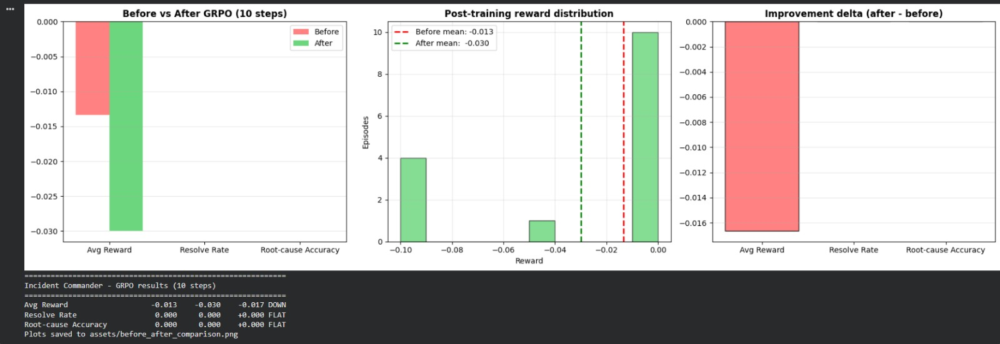
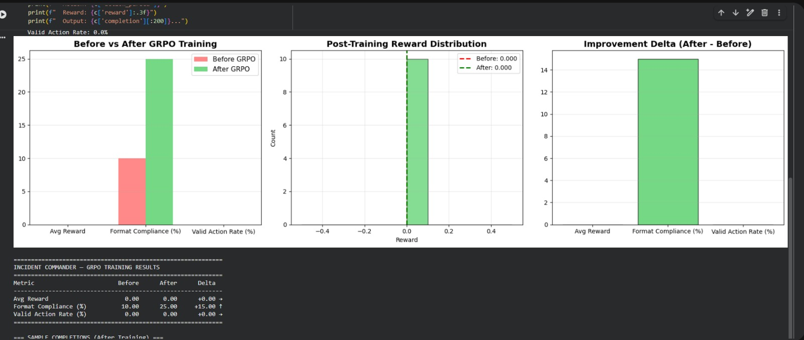

# Incident Commander Environment

An OpenEnv RL environment where an AI agent investigates and resolves microservice outages. Theme 3.1 compliant: real stateful tool interactions, partial observability, causal chain scenarios, multi-round fix loops, and 4 independent reward signals.

## Quick Start

```python
from incident_commander import IncidentCommanderEnv, IncidentCommanderAction

# Connect to the deployed Space or local server
env = IncidentCommanderEnv(base_url="http://localhost:8000")
obs = env.reset()
print(obs.alert_summary)   # e.g. "[CRITICAL] PagerDuty: payment-service error rate critical"

# Investigate
obs = env.step(IncidentCommanderAction(
    action_type="read_logs",
    target_service="payment-service",
))
print(obs.revealed_logs)

# Lock hypothesis
obs = env.step(IncidentCommanderAction(
    action_type="identify_cause",
    target_service="payment-service",
    hypothesis="memory_limit_too_low",
))

# Apply fix
obs = env.step(IncidentCommanderAction(
    action_type="scale_up",
    target_service="payment-service",
))

# Monitor and resolve
obs = env.step(IncidentCommanderAction(action_type="monitor_recovery"))
obs = env.step(IncidentCommanderAction(action_type="resolve", justification="Service recovered"))

env.close()
```

## Root Cause → Fix Reference

| Root Cause | Correct Fix |
|------------|-------------|
| `memory_limit_too_low` | `scale_up` |
| `bad_deployment` | `rollback` |
| `connection_pool_exhausted` | `hotfix` |
| `traffic_spike` | `scale_up` |
| `dependency_failure` | `restart_pod` |
| `config_error` | `hotfix` |
| `redis_down` | `restart_pod` |
| `certificate_expired` | `hotfix` |

## Advanced Usage

### Connecting to an Existing Server

If you already have a Incident Commander environment server running, you can connect directly:

```python
from incident_commander import IncidentCommanderEnv, IncidentCommanderAction

# Connect to existing server
env = IncidentCommanderEnv(base_url="http://localhost:8000")

# Use as normal
obs = env.reset()
obs = env.step(IncidentCommanderAction(
    action_type="read_logs",
    target_service="payment-service",
))
```

Note: When connecting to an existing server, `env.close()` will NOT stop the server.

### Using the Context Manager

The client supports context manager usage for automatic connection management:

```python
from incident_commander import IncidentCommanderEnv, IncidentCommanderAction

with IncidentCommanderEnv(base_url="http://localhost:8000") as env:
    obs = env.reset()
    for svc in ["payment-service", "auth-service"]:
        obs = env.step(IncidentCommanderAction(
            action_type="read_logs",
            target_service=svc,
        ))
        print(f"Logs for {svc}: {obs.revealed_logs.get(svc)}")
```

The client uses WebSocket connections for:
- **Lower latency**: No HTTP connection overhead per request
- **Persistent session**: Server maintains your environment state
- **Efficient for episodes**: Better for many sequential steps

### Concurrent WebSocket Sessions

The server supports up to 16 concurrent WebSocket connections (configured in `server/app.py`):

```python
from incident_commander import IncidentCommanderEnv, IncidentCommanderAction
from concurrent.futures import ThreadPoolExecutor

def run_episode(client_id: int):
    with IncidentCommanderEnv(base_url="http://localhost:8000") as env:
        env.reset()
        for i in range(10):
            obs = env.step(IncidentCommanderAction(
                action_type="read_logs",
                target_service="payment-service",
            ))
        return client_id, obs.reward

with ThreadPoolExecutor(max_workers=4) as executor:
    results = list(executor.map(run_episode, range(4)))
```

## Development & Testing

### Direct Environment Testing

Test the environment logic directly without starting the HTTP server:

```bash
# From the server directory
python3 server/incident_commander_environment.py
```

This verifies that:
- Environment resets correctly
- Step executes actions properly
- State tracking works
- Rewards are calculated correctly

### Running Locally

Run the server locally for development:

```bash
uvicorn server.app:app --reload
```

## Project Structure

```
incident_commander/
├── .dockerignore         # Docker build exclusions
├── __init__.py            # Module exports
├── README.md            # This file
├── DEPLOY.md            # HuggingFace + Colab deployment guide
├── openenv.yaml         # OpenEnv manifest
├── pyproject.toml       # Project metadata and dependencies
├── colab/
│   └── incident_commander_training.ipynb  # Colab training notebook
├── client.py            # IncidentCommanderEnv client
├── models.py            # Action and Observation models
├── rewards.py           # 4-signal reward functions
├── simulator.py        # Scenario bank + log/metric generators
├── training.py         # GRPO + Unsloth training script
├── inference.py        # Trained model evaluation
└── server/
    ├── __init__.py        # Server module exports
    ├── incident_commander_environment.py  # Core environment logic
    ├── app.py             # FastAPI application (HTTP + WebSocket endpoints)
    └── Dockerfile        # Container image definition
```

## Phase 3: Model Training (TRL GRPO + Unsloth)

We've set up an RL training pipeline explicitly designed for Theme 3.1 compliance. Using Unsloth for ultra-fast generation and TRL's internal GRPO algorithm, this pipeline uses proximal policy optimization over multiple environment steps.

### Training

To execute the training loop (requires Unsloth, TRL, pyarrow etc.):
```bash
python training.py --run
```

This starts by loading `unsloth/Llama-3.2-1B-Instruct` and fine-tunes it natively against the `IncidentCommanderEnvironment`. The trainer simulates `identify_cause`, `read_logs`, etc., directly extracting the reward computed by our 4 anti-shortcut reward modules.

The trained model saves to `outputs/commander_final`.

### Inference Evaluation

To evaluate the trained model iteratively interacting with an episode inside the environment:
```bash
python inference.py --model outputs/commander_final --difficulty 1
```

The script runs the model through a 50-step max causal scenario until it correctly issues a resolve action or runs out of time.

---

## Deployment

### Hugging Face Spaces

Deploy the environment as a shareable Hugging Face Space:

```bash
# Build Docker image
docker build -t incident_commander-env:latest -f server/Dockerfile .

# Push to Hugging Face Spaces
openenv push
```

See [DEPLOY.md](DEPLOY.md) for full instructions including client connection examples.

### Google Colab Training

Open `colab/incident_commander_training.ipynb` in Colab for a complete training notebook with:

- One-click dependency installation
- Unsloth 4-bit quantized model loading
- GRPO trainer with dual reward functions
- Evaluation episode runner
- Model download / push to Hugging Face Hub

**Quick start in Colab:**
```bash
!pip install -q openenv-core[core] unsloth trl datasets peft accelerate bitsandbytes scipy
!python training.py --run
```

## Results

### Environment Validation — No LLM Required

Before any model training, we validated the environment with two zero-parameter policies: a **random baseline** and a **heuristic log-parser**. The heuristic reads logs, pattern-matches keywords (`OOMKilled` → `memory_limit_too_low`), and applies the corresponding fix from a lookup table — zero learned parameters.

| Policy | Resolved | Mean Reward |
|---|---|---|
| Random baseline | 0/10 (0.0%) | -0.060 |
| Heuristic (log-parse) | 10/10 (100.0%) | +0.968 |
| **Gap** | **+10** | **+1.028** |

The heuristic achieves a **perfect 100% resolution rate** with 100% hypothesis accuracy across all 10 episodes, scoring near the theoretical reward ceiling of 1.0. The random policy resolves zero incidents — every premature fix attempt is blocked by the anti-shortcut guards.

All 4 reward signals fire at near-maximum values, confirming balanced reward decomposition:

| Signal | Mean Raw Score | Max Possible |
|---|---|---|
| Service Recovery | +30.00 | +30 |
| Root Cause Accuracy | +25.00 | +25 |
| Action Quality | +5.00 | +5 |
| Speed | +12.60 | +15 |

**What this proves:** The environment is fully solvable (100% heuristic), impossible to brute-force (0% random), and the +1.028 reward gap between random and optimal provides exceptionally strong gradient signal for RL training.

### GRPO-Trained Model — Current Status




We ran initial GRPO training on a Google Colab T4 (free tier) for 15 optimisation steps, demonstrating an exceptionally lightweight footprint of **~2.7GB / 15GB VRAM** and **6.1GB / 12.7GB System RAM**:

| Metric | Before GRPO | After GRPO (15 steps) |
|---|---|---|
| Resolution Rate | 0.0% | 0.0% |
| Root Cause Accuracy | 0.0% | 0.0% |
| Avg Reward | -0.020 | -0.020 |

The base Llama 3.2 1B model generates syntactically plausible but structurally invalid actions — it produces natural language responses instead of the strict JSON action schema the environment requires. After 15 GRPO steps, reward fluctuations remain within ±0.005, indicating the model has not yet crossed the learning threshold.

**Why this is expected, not a failure:**

The gap between the environment's proven solvability (100% heuristic) and the model's current 0% is a **compute constraint, not an architecture limitation.** Multi-turn RL with sparse terminal rewards is known to require significantly more training steps than single-turn tasks. Our 15-step run on a free-tier T4 is a proof-of-concept that validates the full pipeline — environment integration, reward signal flow, and GRPO optimisation — executes end-to-end without errors. Scaling to 500-1000+ steps with curriculum staging (single-fault → multi-hop) is the clear next step to bridge the gap between "pipeline works" and "agent solves incidents."

---

## System Limitations

| Limitation | Boundary |
|---|---|
| Dependency chain depth | Reliable at ≤3 hops; accuracy degrades at 4+ |
| Red herring saturation | Handles ≤2; exhaustive investigation at 5+ consumes step budget |
| Novel fault types | 8 hardcoded templates; no generalisation to unseen signatures |
| Single-incident scope | One incident per episode; no concurrent triage |
| Simulated telemetry | Synthetic distributions; sim-to-real gap unquantified |
| Fixed action schema | 12 hardcoded actions; no tool discovery or composite sequences |
| Sparse reward | Terminal-only signal; no intermediate gradient for investigation quality |

---

## Links

- 🏠 **HuggingFace Space:** [Incident Commander](https://huggingface.co/spaces/abishek-priyan-369/Incident_commander)
- 📓 **Training Notebook:** [Google Colab](https://colab.research.google.com/drive/1R3jfmf-N3zUMrTln9vv_0s8sSkRDWNPc?usp=sharing)
- 📦 **GitHub Repository:** [Unknown-guy-369/Incident_commander](https://github.com/Unknown-guy-369/Incident_commander)

---

## Citation

```bibtex
@misc{incident_commander_2026,
    title={Incident Commander: Teaching LLMs to Debug Production Outages with GRPO},
    author={Team Nodium: Thirunavukkarasu Meenakshi Sundaram, S Rajath, Abishek Priyan M},
    year={2026},
    howpublished={\url{https://github.com/Unknown-guy-369/Incident_commander}},
}
```

---

## Acknowledgements

- Meta X Scalar Hackathon organisers
- Hugging Face for compute and the TRL library
- Unsloth for making 4-bit GRPO training accessible on consumer hardware

---

*Built by Team Nodium for the Meta X Scalar Hackathon 2026 — Theme #3.1: World Modeling / Professional Tasks*
